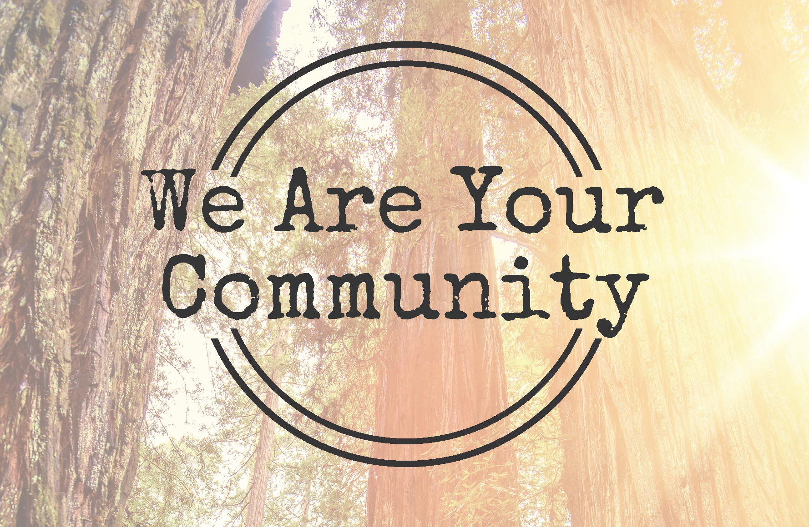

# ideaFest 2018

## HSU DML Showcase
April 19, 2018 3-5:00 pm

Video screening at 4:00 pm

CTL Classroom, 3rd floor of the Library

## HSU Student Snapshots
HSU Student Snapshots is a collection of video stories from Humboldt State University (HSU) students in their own voice. Learn more and how you can add your voice at the [HSU Student Snapshots homepage](http://libguides.humboldt.edu/snapshots) and [YouTube channel](https://www.youtube.com/playlist?list=PLe7DUUoET6mUN1jP4pO6uKW9uyubSkQhC).

<iframe width="560" height="315" src="https://www.youtube-nocookie.com/embed/videoseries?list=PLe7DUUoET6mUN1jP4pO6uKW9uyubSkQhC" frameborder="0" allow="autoplay; encrypted-media" allowfullscreen=""></iframe>

## We Are Your Community
We Are Your Community - Erin Youngblood-Smith and Amy Mathieson are two Masters of Social Work (MSW) students at Humboldt State University focusing on sharing the experiences of African American students with the community. Students of color report feeling isolated and unwelcome and experience acts of discrimination in Humboldt County. In light of this and other recent events, we feel the need for student's stories to be heard is now greater than ever. For our project, four African American students were interviewed about their positive and negative experiences in Humboldt County. These [video interviews](https://www.facebook.com/pg/weareyourcommunity/videos/?ref=page_internal) will be used to create a powerful diversity campaign titled “We Are Your Community.”

---
## Other Links
Humboldt State University Library | [Digital Media Lab](http://libguides.humboldt.edu/dml)

For more info, questions, or suggestions, email dml@humboldt.edu
