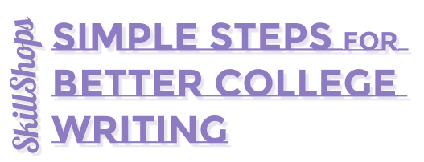
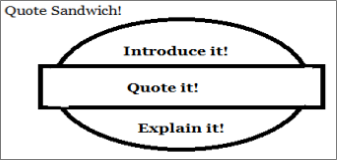

# Simple Steps for Better College Writing
Paraphrases and Quotations

## Digital Media Lab Quick Guide
This short guide will get you started with your project. For more information about this or other topics, visit [http://libguides.humboldt.edu/dml](http://libguides.humboldt.edu/dml).

## Description
This guide will give you a tips and best practices for paraphrasing and quoting in academic papers. 

When do you do it? 
+ “Paraphrase (with proper citations) when all you need is the information itself” (Davis, 2007, p. 16).
+ “Quote when your source is important, when you can gain authority by turning to another author” (Davis, 2007, p. 17).

The amount that you paraphrase/quote may partially be dictated by your discourse. Different genres value different approaches!

## Paraphrasing
Remember to cite when using someone else’s ideas!
+ Take notes while you read and paraphrase from your notes
+ Thoroughly understand the passage 
+ Look away from source and write in your own words

### Try Paraphrasing this Text

>“Their virtual success is rooted in their real biology. Cats are solitary, asocial hypercarnivores built to do one thing: get meat. The famous cat meme I Can Haz Cheeseburger, in which a gaping gray cat demands a quarter-pounder, had the right idea. Every fiber of the feline being is evolved to hunt, and cats employ a distinctive stalk-and-ambush approach, in which they sit very still and watch for prey to innocently wander by, then explode from the underbrush to slaughter it.
This stalking and pouncing is perfect for a six-second Vine or a pithy tweet. Think of your favorite YouTube cat videos: A cat springs into a box, or bops a baby on the head without warning, or rockets out from beneath the bed. What you’re watching is an ambush.”

Tucker, A. (2016, October 15). _How cats evolved to win the Internet_. The New York Times. Retrieved from https://www.nytimes.com/2016/10/16/opinion/sunday/how-cats-
evolved-to-win-the-internet.html

### Things to Keep in Mind
+ Stay true to the author’s point or intention
+ Incorporate the paraphrase into your broader point
+ Don’t copy an author’s word choice, sentence structure, or unique phrases

### Example Paraphrase

>One author interested in cat videos is Abigail Tucker. Having researched cats and social media for years, Tucker (2016) argues that the rise in popularity of cat videos is centered around their hunting instinct. She points out that the seriousness with which cats approach their prey makes them susceptible to humorous juxtapositions (Tucker, 2016).  

## Quoting
+ Tell your readers from whom and/or what you’re quoting
+ Use a signal phrase or a reporting verb
    + “Tucker argues…”
+ Explain the quote to your readers
+ Avoid drop quoting
    + Introduce your readers to the source.
+ Try making a quote sandwich:

### Example: 
>Having researched cats and social media for years, Tucker (2016) argues that a cat’s “stalking and pouncing is perfect for a six-second Vine or a pithy tweet” (Tucker, 2016).  Because of the seriousness with which cats approach their prey, they are susceptible to humorous juxtapositions.

## Additional Resources 
Research Help Desk: [located on the first floor of the library](http://library.humboldt.edu/about/librarymap.html?y=70&x=145&f=1).

[Purdue’s Online Writing Lab](https://owl.english.purdue.edu/owl/)

Davis, J. P. (2007). [The Rowman and Littlefield guide to writing with sources](https://humboldt-primo.hosted.exlibrisgroup.com/primo-explore/fulldisplay?docid=01CALS_ALMA71401610150002901&context=L&vid=01CALS_HUL&search_scope=01CALS&isFrbr=true&tab=books_csu&lang=en_US). Lanham, MD: Rowman and Littlefield Publishers, Inc.

Graff, G., Birkenstein, C., & Durst, R. (2015). [They say, I say: The moves that matter in academic writing](https://humboldt-primo.hosted.exlibrisgroup.com/primo-explore/fulldisplay?docid=01CALS_ALMA71390912200002901&context=L&vid=01CALS_HUL&search_scope=01CALS&tab=books_csu&lang=en_US). New York, NY: W.W. Norton & Company.

The [HSU Writing Studio](http://learning.humboldt.edu/writing-studio): [located on the first floor of the library](http://library.humboldt.edu/about/librarymap.html?y=3&x=132&f=1). Students can [make appointments online](http://learning.humboldt.edu/writing-studio) or in person at the Learning Center front desk. 

Writing Studio hours for Spring 2018 are: 
+ Mondays & Tuesdays 11:00 am-5:00 pm 
+ Wednesday & Thursday 11:00 am-6:00 pm 
+ Fridays 12:00 pm-4:00 pm 
Drop-ins: 
+ Sunday 7:00-9:00 pm 
+ Wednesday & Thursday 6:00 pm-8:00 pm

---
For more info visit: [http://libguides.humboldt.edu/dml](http://libguides.humboldt.edu/dml) or email dml@humboldt.edu

This guide has an open [Creative Commons license](https://creativecommons.org/share-your-work/licensing-types-examples/). You can use, share, remix and repurpose this content as long as you attribute the author, Lydia Leonard-Rhodes [CC BY](https://creativecommons.org/licenses/by/4.0/), 2018. If you’re re-using this guide, we’d love to hear about your project- dml@humboldt.edu.
